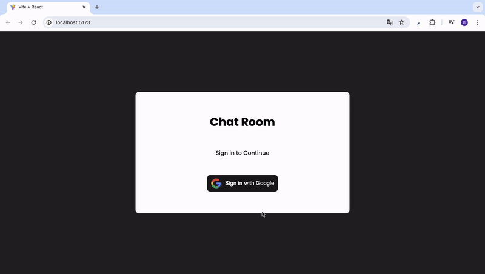

<h1>CHAT-APP _firebase_</h1>

Chat App Firebase is a modern application template developed for real-time communication. With Firebase database integration, it provides instant updates, coupled with the strength of React and Sass for a robust user interface. 

<h2> Software Languages </h2>

- HTML

- SCSS

- JavaScript

<h2> Libraries </h2>

- React

- React Router

<h2> Development Tools </h2>

- Vite

<h2> Database </h2>

- Firebase

<h2> Screen Gif </h2>

